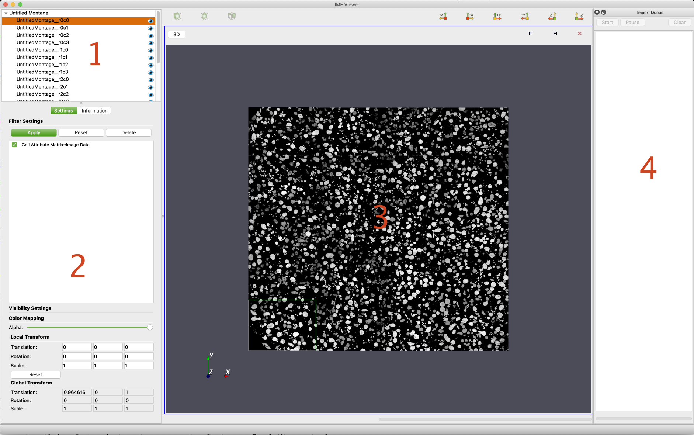

# Overview of the User Interface #

IMFViewer has 4 main sections of its user interface:

1. [Filter View](#filterview)
2. [Filter Information Widget](#filterinfowidget)
3. [Visualization Widget](#vizwidget)
4. [Import Queue](#importqueue)

The **Import Queue** can be _undocked_ from the main window and moved around. Additionally, it can also have its visibility toggled by the appropriate button found in IMFViewer's **View** menu.

IMFViewer allows the user to import image, DREAM.3D, STL, and VTK files as well as entire montages into the application and visualize the data. Users can import new data by clicking the _Import Data_ option in the _File_ menu, or by choosing a montage import method in the _Import Montage_ menu inside the _File_ menu.  Data that is currently being imported will appear in the **Import Queue** until the import is complete. Filter objects are created for imported data in the **Filter View** and the imported data also appears as a dataset in the **Visualization Widget**.  Users can manipulate fields in the **Filter Information Widget** to change information about the current dataset like its color mapping, alpha value, and local transform.

---

<a name="filterview">
## Filter View ##
</a>

The **Filter View** section displays which **Filters** are currently loaded in the IMFViewer application.  Users can select specific filters and perform operations on them, such as translating, rotating, and scaling datasets in 3D space or stitching individual tiles together into a montage.