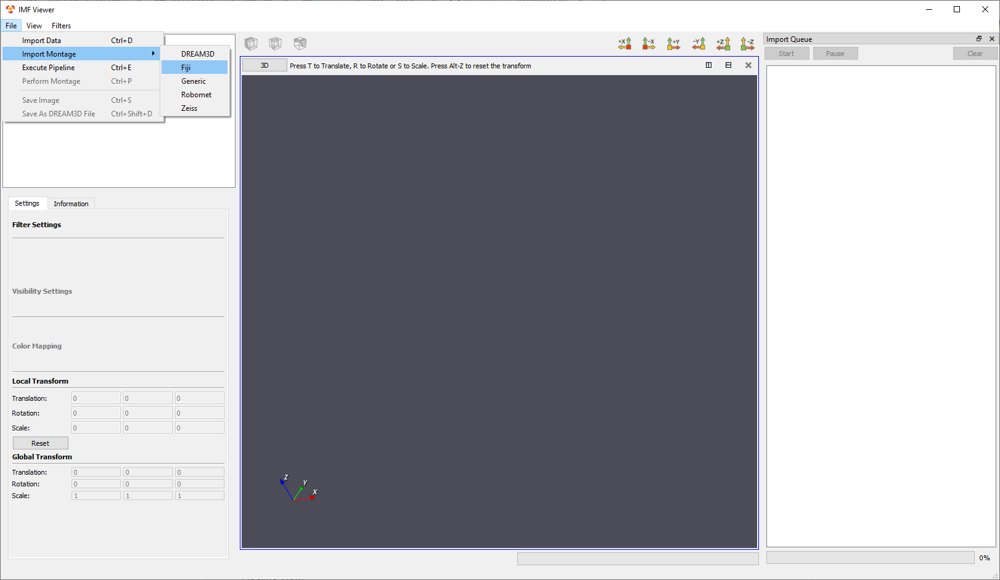
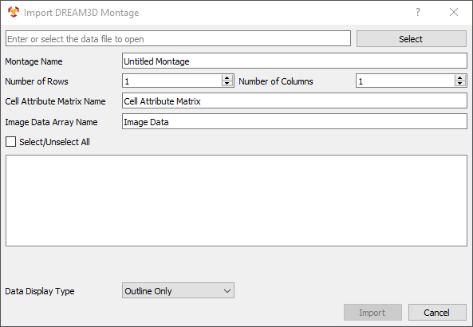
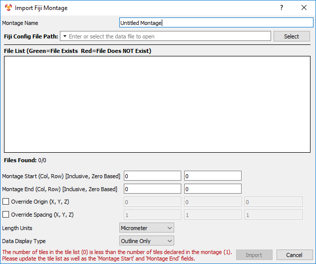
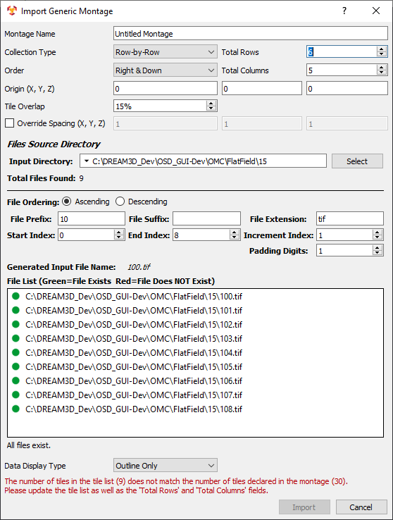
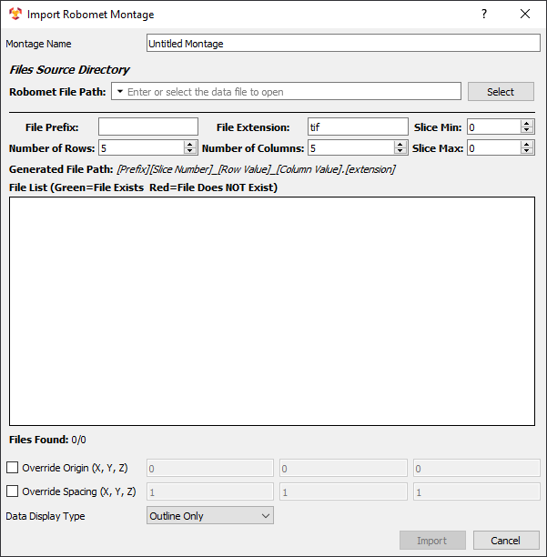
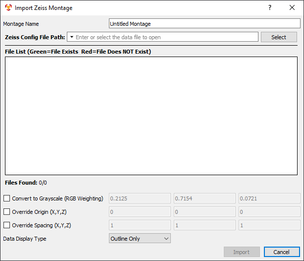

Importing A Montage Dataset
=========
IMFViewer has 5 options for importing a montage:

1. [DREAM3D Montage](#dream3d)
2. [Fiji](#fiji)
3. [Generic](#generic)
4. [Robomet](#robomet)
5. [Zeiss](#zeiss)

In **IMF Viewer**, the **File** menu option contains a submenu for **Import Montage**. In this submenu, there are 5 options for importing montages. These options are discussed below.

---

<a name="dream3d">
## DREAM3D Montage ##
</a>

The **DREAM3D Montage** allows the user to import image geometry from a DREAM3D file by specifying the cell attribute matrix and image data array names. To select a DREAM3D file, click the **Select** button and use the dialog to find it. The row and column values are auto-filled by the naming convention (**prefix**_rYcX with Y the row number and X the column number). The **Data Display Type** option sets the visualization representation and determine whether to run a montaging process. The options are **Outline Only**, **Individual Tiles**, and **Stitched Montage**. When the desired values have been set, click **Import** to load the dataset into **IMF Viewer**.

---

<a name="fiji">
## Fiji##
</a>

The **Fiji** allows the user to import image geometry from a Fiji configuration file. To select a Fiji configuration file, click the **Select** button and use the dialog to find it. The **File List** widget shows the referenced files from the Fiji configuration file and shows whether they have been found. Additional options include overriding the origin and/or spacing of the image geometry. The **Data Display Type** option sets the visualization representation and determine whether to run a montaging process. The options are **Outline Only**, **Individual Tiles**, and **Stitched Montage**. When the desired values have been set, click **Import** to load the dataset into **IMF Viewer**.

---

<a name="generic">
## Generic ##
</a>

The **Generic** montage allows the user to import image geometry from a folder of images. To select an image folder, click the **Select** button and use the dialog to find it. The **Collection Type**, **Order**, **Total Rows**, and **Total Columns** are used to help construct a tile configuration file. Additional options include overriding the origin and/or spacing of the image geometry and setting the tile overlap. The file information (prefix, suffix, extension, start/end index, increment index, and padding digits) should fill in automatically. Typing in the **File Extension** before selecting the folder helps. The **File List** widget shows the image files in the folder and shows whether they have been found. The **Data Display Type** option sets the visualization representation and determine whether to run a montaging process. The options are **Outline Only**, **Individual Tiles**, and **Stitched Montage**. A warning may appear if the number of files in the list do not match the size based on **Total Rows** and **Total Columns**. For example, if 9 files are in the list, the product of total rows and columns must equal 9. When the desired values have been set, click **Import** to load the dataset into **IMF Viewer**.

---

<a name="robomet">
## Robomet Montage ##
</a>

The **Robomet** montage allows the user to import image geometry from a Robomet configuration file. To select a Robomet configuration file, click the **Select** button and use the dialog to find it. The file information (prefix, extension, rows, and columns) should fill in automatically. The **Slice Min** and **Slice Max** default to zero. These allow the user to run montages on several slices from the Robomet configuration file. These slices are combined into a stack in the visualization. The **File List** widget shows the image files in the folder and shows whether they have been found. Additional options include overriding the origin and/or spacing of the image geometry. The **Data Display Type** option sets the visualization representation and determine whether to run a montaging process. The options are **Outline Only**, **Individual Tiles**, and **Stitched Montage**. When the desired values have been set, click **Import** to load the dataset into **IMF Viewer**.

---

<a name="zeiss">
## Zeiss ##
</a>

The **Zeiss** allows the user to import image geometry from a Zeiss configuration file. To select a Zeiss configuration file, click the **Select** button and use the dialog to find it. The **File List** widget shows the referenced files from the Zeiss configuration file and shows whether they have been found. Additional options include converting the images to grayscale and overriding the origin and/or spacing of the image geometry. The **Data Display Type** option sets the visualization representation and determine whether to run a montaging process. The options are **Outline Only**, **Individual Tiles**, and **Stitched Montage**. When the desired values have been set, click **Import** to load the dataset into **IMF Viewer**.
