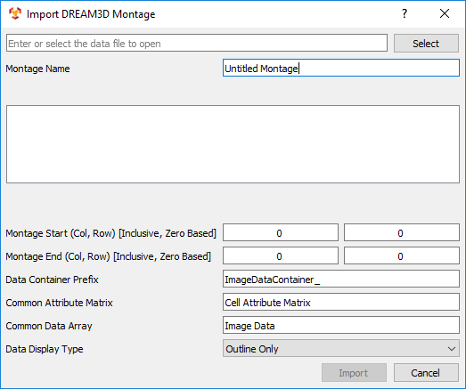
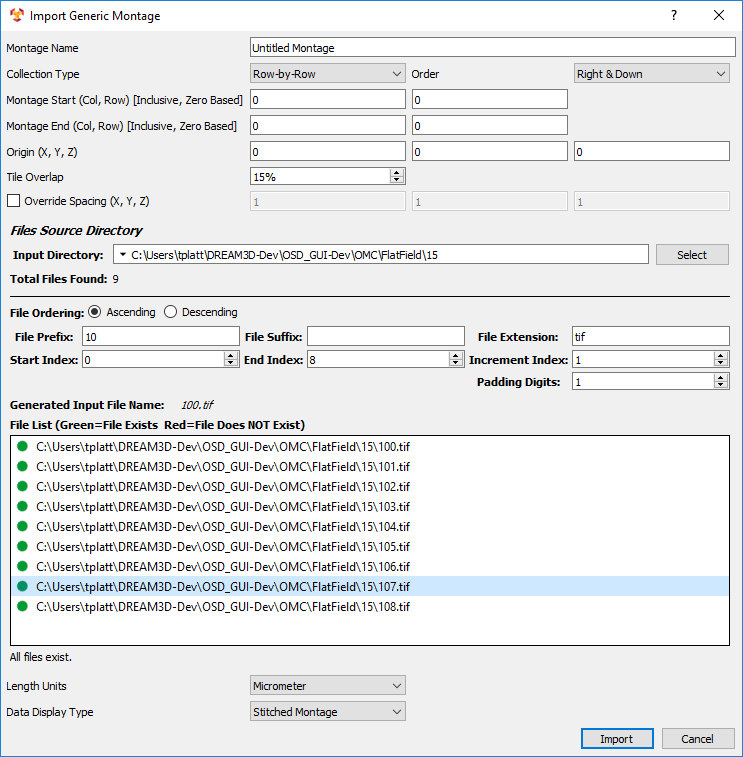
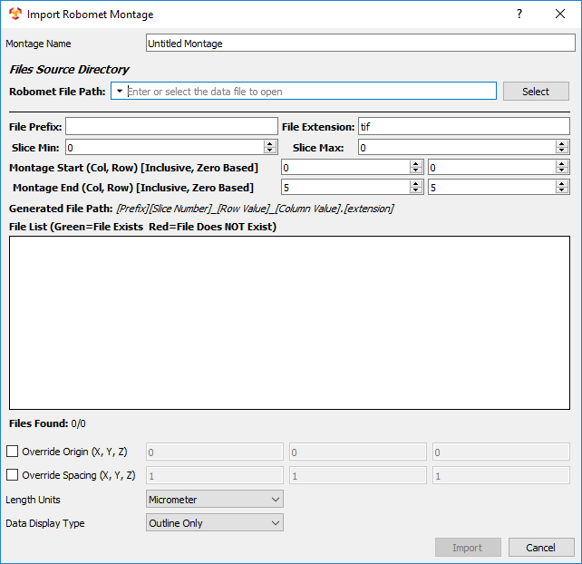
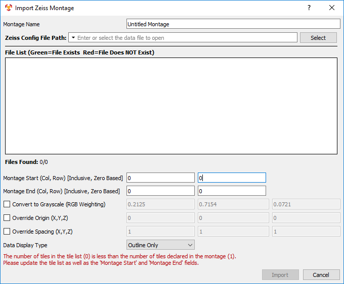
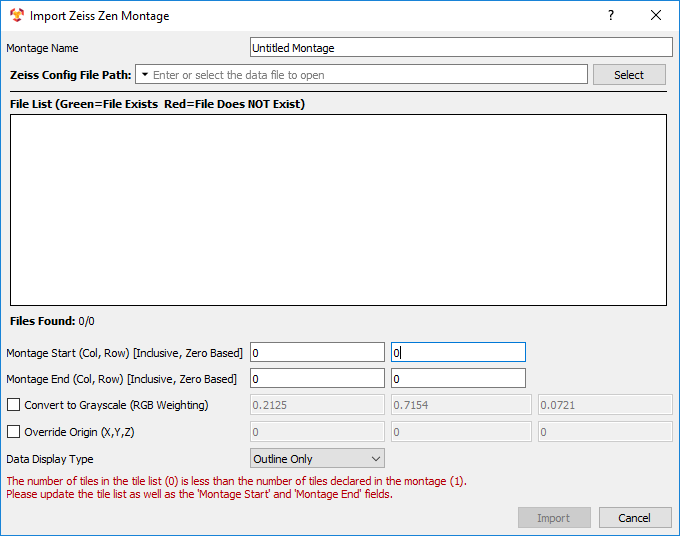
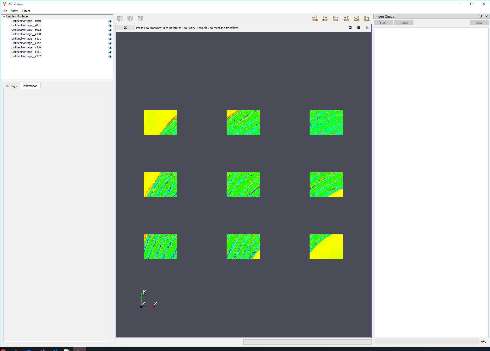

Importing A Montage Dataset
=========
IMFViewer has 5 options for importing a montage:

1. [DREAM3D Montage](#dream3d)
2. [Fiji](#fiji)
3. [Generic](#generic)
4. [Robomet](#robomet)
5. [Zeiss XML](#zeissxml)
6. [Zeiss Zen](#zeisszen)

In **IMF Viewer**, the **File** menu option contains a submenu for **Import Montage**. In this submenu, there are 5 options for importing montages. These options are discussed below.

For all montage options, the user can select a **Data Display Type** for the visualization of the montage. The **Outline Only** option shows a white wireframe of the overlapped image tiles. The **Individual Tiles** option shows the images overlapped with the image data visible. The **Stitched Montage** option performs a stitching montage on the input image datasets and displays the result.

For the **Fiji**, **Generic**, and **Robomet** montage options, the user can specify the **Length Units** of the image files such as micrometers or inches. These will be applied to the geometry information for the input and output of the montages.

[Special Note for Fiji montages using TIF files](#fijitif)

---

<a name="dream3d">
## DREAM3D Montage ##
</a>

The **DREAM3D Montage** allows the user to import image geometry from a DREAM3D file by specifying the cell attribute matrix and image data array names. To select a DREAM3D file, click the **Select** button and use the dialog to find it. The row and column values are auto-filled by the naming convention (**_prefix_**_rYcX with Y the row number and X the column number). The **Data Display Type** option sets the visualization representation and determines whether to run a montaging process. The options are **Outline Only**, **Individual Tiles**, and **Stitched Montage**. When the desired values have been set, click **Import** to load the dataset into **IMF Viewer**.

---

<a name="fiji">
## Fiji##
</a>

The **Fiji** allows the user to import image geometry from a Fiji configuration file. To select a Fiji configuration file, click the **Select** button and use the dialog to find it. The **File List** widget shows the referenced files from the Fiji configuration file and shows whether they have been found. Additional options include overriding the origin and/or spacing of the image geometry. When the desired values have been set, click **Import** to load the dataset into **IMF Viewer**.

---

<a name="generic">
## Generic ##
</a>

The **Generic** montage allows the user to import image geometry from a folder of images. To select an image folder, click the **Select** button and use the dialog to find it. The **Collection Type**, **Order**, **Total Rows**, and **Total Columns** are used to help construct a tile configuration file. Additional options include overriding the origin and/or spacing of the image geometry and setting the tile overlap. The file information (prefix, suffix, extension, start/end index, increment index, and padding digits) should fill in automatically. Typing in the **File Extension** before selecting the folder helps. The **File List** widget shows the image files in the folder and shows whether they have been found. A warning may appear if the number of files in the list do not match the size based on **Total Rows** and **Total Columns**. For example, if 9 files are in the list, the product of total rows and columns must equal 9. When the desired values have been set, click **Import** to load the dataset into **IMF Viewer**.

---

<a name="robomet">
## Robomet Montage ##
</a>

The **Robomet** montage allows the user to import image geometry from a Robomet configuration file. To select a Robomet configuration file, click the **Select** button and use the dialog to find it. The file information (prefix, extension, rows, and columns) should fill in automatically. The **Slice Min** and **Slice Max** default to zero. These allow the user to run montages on several slices from the Robomet configuration file. These slices are combined into a stack in the visualization. The **File List** widget shows the image files in the folder and shows whether they have been found. Additional options include overriding the origin and/or spacing of the image geometry. When the desired values have been set, click **Import** to load the dataset into **IMF Viewer**.

---

<a name="zeissxml">
## Zeiss XML##
</a>

The **Zeiss XML** allows the user to import image geometry from a Zeiss XML configuration file. To select a Zeiss XML configuration file, click the **Select** button and use the dialog to find it. The **File List** widget shows the referenced files from the Zeiss XML configuration file and shows whether they have been found. Additional options include converting the images to grayscale and overriding the origin and/or spacing of the image geometry. When the desired values have been set, click **Import** to load the dataset into **IMF Viewer**.

---

<a name="zeisszen">
## Zeiss Zen##
</a>

The **Zeiss Zen** allows the user to import image geometry from a Zeiss Zen configuration file. To select a Zeiss Zen configuration file, click the **Select** button and use the dialog to find it. The **File List** widget shows the referenced files from the Zeiss Zen configuration file and shows whether they have been found. Additional options include converting the images to grayscale and overriding the origin and/or spacing of the image geometry. When the desired values have been set, click **Import** to load the dataset into **IMF Viewer**.

---

<a name="fijitif">
## Special Note for Fiji montages using TIF files ##
</a>

When importing a montage using Fiji configuration files that reference TIF files, there may be issues with spacing. Similar issues may arise from using the **Generic** montage. The undesirable results are shown below.

To resolve this, you can set the Override Spacing to (1, 1, 1) in the **Import Fiji Montage** dialog box. This will address the issue with Fiji montages using TIF files. 