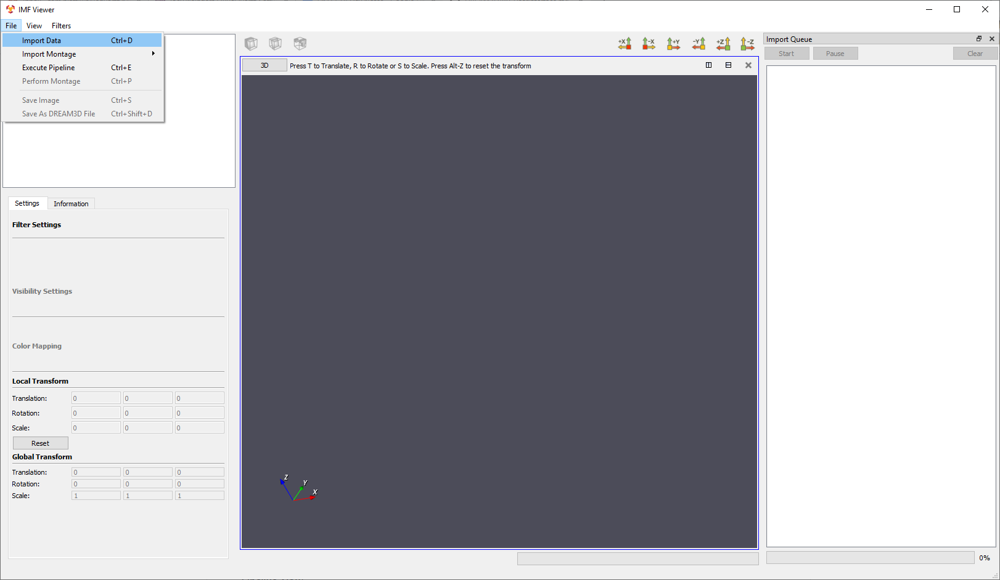

Importing Other Datasets
=========
IMFViewer has 5 options for importing a montage:

1. [DREAM3D File](#dream3d)
2. [VTK File](#vtk)
3. [STL File](#stl)
4. [Image File](#image)

In **IMF Viewer**, the **File** menu option contains an option for **Import Data**. In the dialog that opens, there are 4 options for file types. Multiple files can be selected. These options are discussed below.

---

<a name="dream3d">
## DREAM3D File ##
</a>

The user can open DREAM3D files of the extension: .dream3d. These are produced by the DREAM3D software package and contain geometry data that is used for visualization purposes. 

---

<a name="vtk">
## VTK File ##
</a>

The user can open VTK files that are native to the Visualization Tool Kit. These supported extensions include: .vtk | .vti | .vtp | .vtr | .vts | .vtu.

---

<a name="stl">
## STL File ##
</a>

The user can open STL files that are native to the stereolithography CAD software created by 3D Systems. These supported extensions include: .stl.

---

<a name="image">
## Image File ##
</a>

The user can image files of the extensions: .png | .tif | .jpg | .bmp. These files default to an origin of 0, 0, 0 and a spacing based on the file. Images are loaded into the visualization widget as textured planes. 
