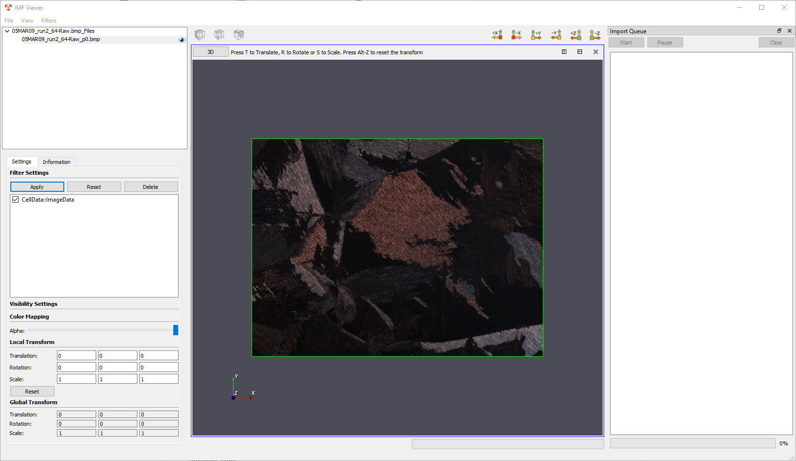
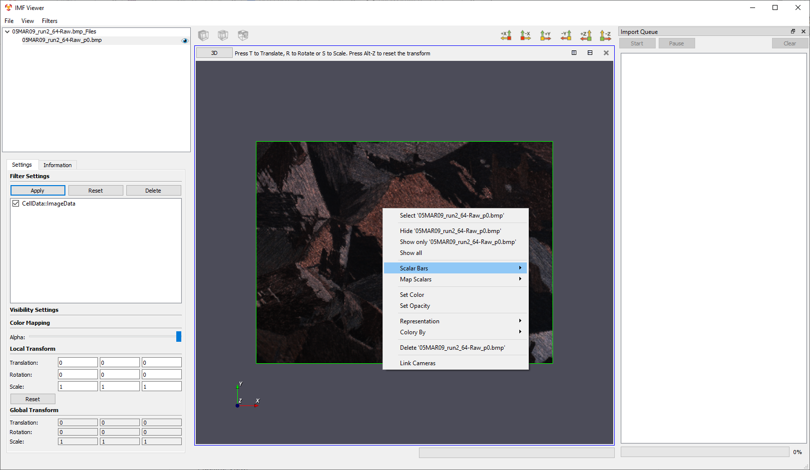

# Manipulating Datasets #
IMFViewer has 3 primary ways for manipulating datasets:

1. [User Interface](#ui)
2. [Context Menu](#contextx)
3. [Keyboard Shortcuts](#keyboard)

The user can manipulate datasets using the user interface, context menu via right-click on the dataset or keyboard shortcuts. Both ways require desired datasets to be selected. If the selected dataset is an image, a green selection outline appears on it in the visualization area.

---

<a name="ui">
## User Interface ##
</a>

The options available in the user interface are contingent upon the dataset's underlying type. If it is 3D data, there are additional options for changing the representation (Outline, Surface, etc.), visualized data array and component, subsampling, and color mapping. For 2D and 3D data, there are options to adjust the **Alpha** (transparency) value as well as the **Local Transform**. If the user wants to revert the transform to its default, there is a **Reset** button in the **Local Transform** section to do so.

---

<a name="context">
## Context Menu (Right-Click) ##
</a>

In the context menu, the user can manipulate a dataset by hiding/showing it, showing all datasets, hiding/showing **Scalar Bar**, mapping scalars, setting color, setting opacity, changing the representation, and coloring source.

---

<a name="keyboard">
## Keyboard Shortcuts ##
</a>

The keyboard shortcuts can be used to manipulate a dataset's transform (position, rotation, and scale). It follows a scheme similar to the open source 3D modeling software, Blender. However, it is not exactly the same. The shortcuts are primarily designed for manipulation of images. 

To initiate a transform, press the R for rotation, S for scaling, and T for translation (change of position). Pressing X, Y, or Z snaps the transform to that axis. Additionally, numerical entry is supported whether or not an axis is selected. The user can enter integer or float/double values. Pressing the Spacebar keeps the changes. Ctrl-Z to undo the most recent transform. Ctrl-Y to redo the most recent undone transform. Ctrl-A selects all the tiles available (across multiple datasets if more than one is open). Alt-Z resets the transform of selected datasets.

Keyboard Shortcuts Summary:
* R for Rotation, S for scaling, T for translation
* X, Y, or Z to snap to an axis
* Numerical entry including "." for decimals to specify precise transforms
* Ctrl-Z - Undo most recent transform
* Ctrl-Y - Redo most recent undone transform
* Ctrl-A - Select all tiles
* Alt-Z - Reset the transform

Examples:
* Pressing T then X then 55 will move the selected dataset(s) 55 units in the positive X direction. 
* Pressing S then Y then 1.5 will scale the selected dataset(s) 50% larger in the Y direction.
