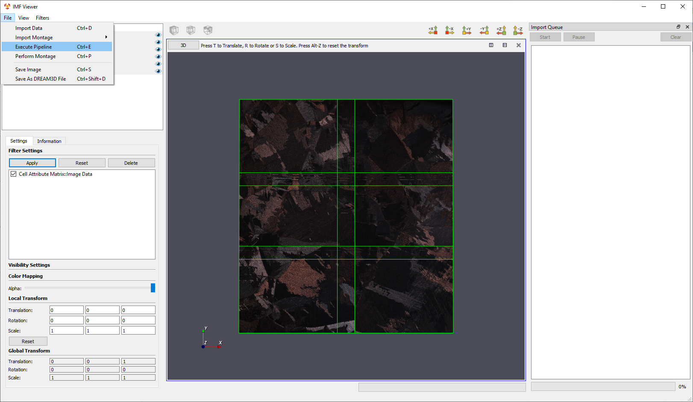
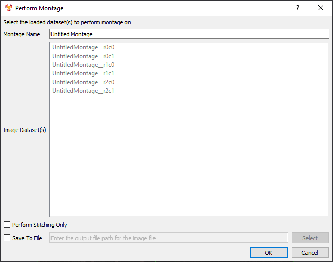
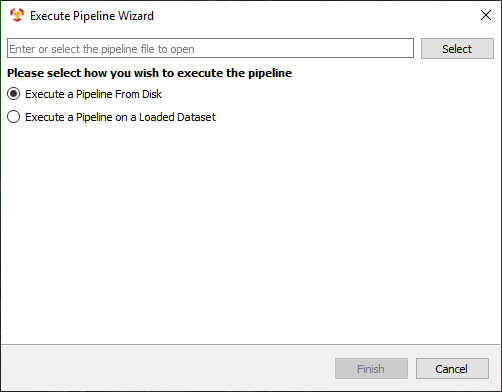

Advanced Options
=========
IMFViewer has advanced options for performing a montage and executing pipelines:

1. [Perform Montage](#performMontage)
2. [Execute Pipeline](#executePipeline)

In **IMF Viewer**, the **File** menu option contains options for performing a montage and executing a pipeline.

---

<a name="performMontage">
## Perform Montage ##
</a>

The **Perform Montage** menu option allows the user to perform a montage of selected image datasets. The selected datasets are shown in a read-only list. The resulting montage can be named. Selecting **Perform Stitching Only** will ensure the current positions for selected image datasets are kept and the registration filter is not run. The **Save to File** option allows the user to select an output file for the montage results.

---

<a name="executePipeline">
## Execute Pipeline ##
</a>

The **Execute Pipeline** menu option allows the user to execute a pipeline either purely from the file system or on a loaded dataset. If the **Execute a Pipeline From Disk** is selected, the user needs only to select a pipeline .json file and click **OK**. However, all filters in the JSON file must be available for it to run successfully. If the user selects **Execute a Pipeline on a Loaded Dataset**, then an additional page is shown after clicking **Next >**. The further options include selecting a starting filter, a loaded dataset, the display type, and setting the origin and/or spacing for the image geometry.